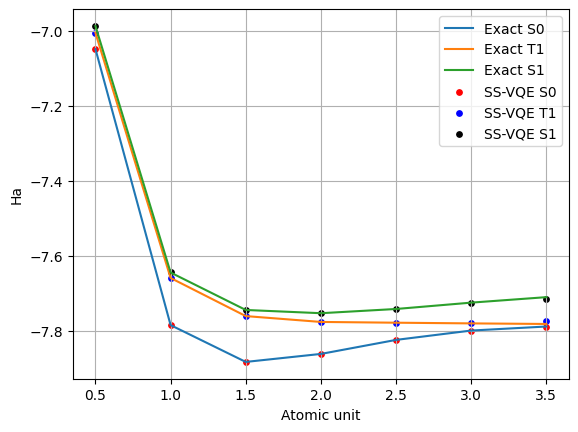
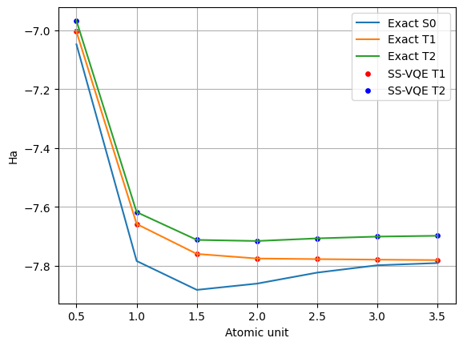
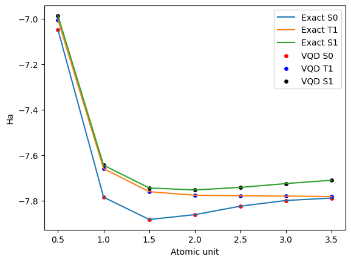
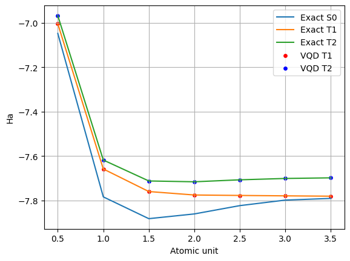

# Crossing The Gap Using VQE: A comparative study

Within the evolving domain of quantum computational chemistry, the Variational Quantum Eigensolver (VQE) has been identified as a crucial algorithm for exploiting the capabilities of near-term quantum computers. This work investigates the proficiency of variational quantum algorithms, particularly adaptive VQE techniques, and Quantum Natural Gradient (QNG) optimization, in calculating the spectral gap of chemical molecules—a key determinant of material characteristics and chemical behavior. Our methodology introduces different approaches to estimating the k-th excited state by mapping highly excited states to the ground state via unitary transformations, broadening VQE's applicability.
Our research focuses on analyzing three molecular systems, $H_2$, $LiH$, and $BeH_2$, to demonstrate the versatility and precision of our proposed methods. A significant highlight of our study is the implementation of QNG optimization, which markedly improves the optimization process's efficiency. It consistently minimizes the ground state energy while achieving convergence in fewer iterations than traditional gradient descent optimizers. This efficiency underscores the advantage of QNG in navigating the complex optimization landscape of quantum parameters more effectively.
Additionally, our comparative analysis reveals that both subspace variational quantum eigensolver (SS-VQE) and quantum variational deflation (VQD) methods exhibit strong performance in spectral gap determination, with less than 1\% relative error for $LiH$, and notably, VQD achieves an exceptional 99.99999\% accuracy. Lastly we explore Pauli tapering and the usage of a tensor network ansatz to improve algorithm speed.


## Methodology
### Subspace-Search Variational Quantum Eigensolver
The Subspace-Search Variational Quantum Eigensolver (SS-VQE) is an algorithm designed to address the challenge of calculating excited states \cite{PhysRevResearch.1.033062}. SS-VQE efficiently explores a low-energy subspace to identify the k-th excited state by utilizing orthogonal input states and leveraging unitary transformations. It is worth noting that this method involves only two parameter optimization steps and eliminates the necessity for ancilla qubits. SS-VQE further generalizes all excited states up to the k-th through a single optimization procedure. Through careful parameter optimization, this approach ensures the orthogonality of input states and accurately maps them to energy eigenstates.
This approach minimize the following loss function

```math
\mathcal{L}_w(\theta) = w\bra{\psi_k}U^\dagger(\theta)HU(\theta)\ket{\psi_k} +\sum_{j=0}^{k-1}\bra{\psi_j}U^\dagger(\theta)HU(\theta)\ket{\psi_j}
```

where the cost $\mathcal{L}_w$ gets its global optimum, the circuit $U(\theta)$ maps $\ket{\psi_k}$ to the k-th excited state $\ket{E_k}$ of the Hamiltonian(H) and others to the
subspace spanned by $`\sum_{j=0} E_j`$ with $j$ bounded from above by $k-1$.

### Variational Quantum Deflation

The potential of VQE for near-term quantum computing is generating excitement for the advancement of computational capabilities.  \cite{Higgott2019variationalquantum} study aims to enhance VQE's functionality by efficiently identifying excited states. By incorporating ``overlap'' terms into the optimization function and leveraging Hermitian matrices, which consist of a complete set of orthogonal eigenvectors, this work demonstrates a cost-effective approach. Utilizing VQE's ability to maintain classical parameters, low-depth quantum circuits are employed to compute these overlap terms. This methodology maintains the same qubit count as VQE for ground-state calculations, with only a minor increase in measurements. In contrast to existing methods for computing excited states in quantum computing, this approach minimizes resource overhead. The following loss function has been provided over this work. 
```math
\mathcal{L}(\lambda_k) =  \bra{\psi(\lambda_k)}H\ket{\psi(\lambda_k)} +\sum_{i=0}^{k-1} \beta_i |\braket{\psi(\lambda_k)|\psi(\lambda_i)}|^2
```

### Folded Spectrum VQE

Expanding on the VQE, \cite{tazi2023folded} study introduces a specialized method for calculating molecular excited states. By utilizing the Folded Spectrum (FS) approach, we restructure the Hamiltonian's eigenspectrum to specifically target highly excited states. While FS has been acknowledged in the past, its quantum application was previously considered too costly due to the exponential growth of terms in the measured operator. Nevertheless, our implementation reveals a significant advancement by employing a Pauli grouping technique, which can significantly reduce the number of required measurements, making FS a cost-efficient option. This technique has a particularly notable impact on second quantized molecular Hamiltonians, thanks to their distinct structural properties. The loss function for this procedure is 
```math
\mathcal{L}(\theta)=\bra{\psi(\theta)}(H-\omega)^2\ket{\psi(\theta)},
```
where $\omega$ is an arbitrary scaler energy value. 
### VQE with Quantum Natural Gradient

The landscape of optimization problems encountered in VQE applications is characteristically intricate, often riddled with many local minima. This complexity underscores the necessity of employing an effective optimization strategy, pivotal for the algorithm's successful convergence to the ground state energy of the system under study.

Among various optimization techniques, the QNG optimization strategy, which stands out by using the geometric properties of the parameter space \cite{QNG}. Contrary to the traditional gradient descent method, which operates under the assumption of an Euclidean metric space, QNG employs the Fubini-Study metric tensor, denoted as $g$, to modulate the optimization step sizes. This tensor captures the variational state space's inherent curvature, facilitating more informed and efficacious optimization steps.

The essence of the QNG approach is encapsulated in the update rule:

```math
\boldsymbol{\theta}_{\text{new}} = \boldsymbol{\theta} - \eta g(\boldsymbol{\theta})^{-1} \nabla f(\boldsymbol{\theta}),
```

where $\boldsymbol{\theta}$ denotes the variational circuit parameters, $\eta$ signifies the learning rate, $g(\boldsymbol{\theta})$ represents the Fubini-Study metric tensor, and $\nabla f(\boldsymbol{\theta})$ is the gradient of the objective function with respect to $\boldsymbol{\theta}$. The objective function $f$ typically corresponds to the expectation value of the Hamiltonian, whose ground state energy the VQE seeks to approximate.

By accounting for the parameter space's geometry, the QNG optimizer significantly enhances the efficiency of the optimization process. It navigates the circuit's sensitivity to parameter variations, circumventing suboptimal pathways often pursued by conventional optimization methods.

Algorithm~\ref{alg:VQE_QNG} delineates the procedural steps for incorporating QNG optimization within the VQE.

## Results
In our study, we meticulously analyzed the efficacy of the SS-VQE for calculating the energy states of $LiH$, emphasizing its performance in different spin subspaces. The results are distilled into Figs. \ref{ess1} and \ref{ess2} show the energy profiles for the ground and excited states at $S_z=0$ and $S_z=1$ cases respectively.
Fig. \ref{ess1} reveals the SS-VQE's proficiency in approximating the singlet ground state (S0) and triplet first excited state (T1) of $LiH$ at $S_z=0$. The alignment of SS-VQE results with the exact theoretical calculations is particularly noteworthy for shorter bond lengths, a region crucial for understanding chemical bonding and reactions. The observed convergence of energy values at increased atomic separations reflects the algorithm's capability to capture the dissociative characteristics of the molecule, demonstrating its robustness in quantum state representation for non-interacting atomic scenarios.
Fig. \ref{ess1}  extends this comparison to $S_z=1$, offering insights into the SS-VQE's ability to model excited spin states accurately. The close correlation between SS-VQE and exact calculations for T1 and T2 states across various atomic distances underscores the versatility of the algorithm. This precision holds even as the bond lengthens, indicating that SS-VQE can adeptly model the $LiH$ molecule's behavior under stretched conditions, which is vital for simulating molecular dynamics.


In Fig. \ref{rss1}, the relative error for the S0 and T1 states at $S_z=0$ is quantified, exhibiting SS-VQE's remarkable precision with errors maintained below 0.8\%. This high accuracy is retained across the spectrum of bond lengths, confirming the algorithm's exceptional ability to capture quantum mechanical interactions within the molecule.
Fig. \ref{rss2}  further corroborates the method's precision, where the SS-VQE sustains an impressively low relative error for the T1 and T2 states at $S_z=1$. With errors well below 0.003\%, SS-VQE is an invaluable tool for precisely estimating quantum states, particularly in molecules exhibiting non-zero spin states.

These compelling findings highlight SS-VQE's potential to transform the landscape of quantum computational chemistry. The accuracy and precision demonstrated in this study pave the way for advanced modeling of molecular systems, offering a new lens through which we can observe and predict the quantum behavior of chemical substances. The implications of this work are profound, promising advancements in fields ranging from material science to pharmaceutical development, where the understanding of quantum states is fundamental.

### SS-VQE

   
   


### VQD
The VQD approach has been meticulously evaluated for its ability to predict the energy states of $LiH$, focusing on its performance across different spin subspaces, $S_z=0$ and (b) $S_z=1$. The analyses encompass both the accuracy of the energy estimations and the relative errors in these calculations.
The energy profiles of $LiH$ obtained via VQD display remarkable fidelity to the exact theoretical calculations, with a pronounced accuracy in the chemically significant region of shorter bond lengths. As shown in Figs. \ref{VQD1} and \ref{VQD2}, VQD's calculated energies for the ground and excited states at$S_z=0$ and  $S_z=1$, respectively, closely track the exact values across a range of atomic separations. This agreement is particularly noticeable in the molecular dissociation limit, where VQD and exact calculations predict the energy levels' convergence toward a constant value.

The relative error analyses are shown in Figs. \ref{rVQD1} and \ref{rVQD2} for $S_z=0$ and $S_z=1$, further underscore the precision of the VQD approach. The errors remain exceptionally low, with the largest observed errors not exceeding 0.0175\% for $S_z=0$ and peaking just below 0.0010\% for the excited states at $S_z=1$ These low relative errors across the atomic units underscore the VQD's robustness and its adaptability to quantum mechanical subtleties inherent in the excited states of the molecule.

### QNG Optimizer Effect
Our investigation employed a VQE framework enhanced by the QNG optimizer to determine the ground state energies of hydrogen (\(H_2\)), lithium hydride (\(LiH\)), and beryllium hydride (\(BeH_2\)) molecules. The results underscore the QNG optimizer's efficacy in navigating the optimization landscape, accelerating convergence to the ground state energy compared to traditional gradient descent methods.


For the \(H_2\) molecule, initial optimization efforts using traditional gradient descent exhibited gradual energy reductions, achieving a final convergence parameter of \(0.00000097\) Ha after 120 iterations. Notably, the introduction of QNG optimization markedly improved the efficiency, reaching a similar convergence threshold of \(0.00000022\) Ha in merely 16 iterations, as summarized below:


* Initial Energy: \(-0.09424484\) Ha.
* Final GD Energy: \(-1.13615247\) Ha after 120 iterations.
* Final QNG Energy: \(-1.13618926\) Ha after 16 iterations.


The optimization for the \(LiH\) molecule demonstrated the QNG optimizer's ability to reduce the energy across iterations consistently. The final ground state energy attained via QNG optimization was \(-7.60898098\) Ha, showcasing a significant improvement over traditional methods:

\begin{itemize}
    \item Initial Energy: \(-3.80567655\) Ha.
    \item Final GD Energy: \(-7.60440889\) Ha after 190 iterations.
    \item Final QNG Energy: \(-7.60898098\) Ha after 190 iterations.
\end{itemize}

For \(BeH_2\), both optimization approaches converged to a similar energy value, indicating the potential limitations of traditional optimization methods for more complex molecular systems. The final energies underscore the precision of QNG in fine-tuning the variational parameters:

\begin{itemize}
    \item Initial Energy: \(-4.62101342\) Ha.
    \item Final GD Energy: \(-13.08284703\) Ha after 140 iterations.
    \item Final QNG Energy: \(-13.08286007\) Ha after 10 iterations.
\end{itemize}


As presented in Fig. \ref{fig:energy-convergence}, these results clearly illustrate the advantage of employing the QNG in the VQE algorithm, particularly in terms of efficiency and convergence speed. The marked improvement in optimization performance across different molecular systems underscores the potential of QNG to enhance quantum computational chemistry applications. Fig. \ref{fig:gs} shows energy estimations across various atomic distances using QNG and adaptive VQE for $LiH$ \cite{AdaptiveVQE}. This approach includes a recipe to adaptively select gates that have a significant contribution to the desired state. We select only gates that have a predefined threshold above $10^{-5}$. The results closely match the expected from exact diagonalization exemplifying QNG quantum chemistry applicability.


### Exploring algorithm speed improvement
In addition to using QNG to reduce the number of iterations for convergence, we apply Pauli tapering, leveraging $Z_2$ molecular hamiltonian symmetries to reduce the number of qubits required for the VQE simulation. Additionally, we test the use of the MERA tensor network ansatz \cite{PhysRevLett.101.110501} and find that it greatly improves the speed at which a SSVQE custom algorithm finds the first excited state at the expense of accuracy at certain distance values as shown in Fig.~\ref{fig:tensorLiH}. 


## Conclusion

Our investigation into advanced variational quantum algorithms, notably SS-VQE, VQD, Folded Spectrum VQE, and VQE with QNG, illuminates the path forward in quantum computational chemistry. These methodologies, each with its unique approach to navigating the challenges of quantum optimization, collectively underscore a significant leap toward harnessing quantum computing's potential for chemical and material science.
SS-VQE and VQD have demonstrated robust capabilities in accurately determining the spectral gap of chemical molecules, a critical parameter influencing material properties. With precision that approaches near-exactness, particularly noted in the spectral gap analysis of LiH with less than 1\% relative error, these strategies highlight the precision achievable with quantum computational approaches.

Folded Spectrum VQE further extends the versatility of quantum algorithms to identify highly excited states, offering a broader understanding of molecular dynamics and energetics. By facilitating a comprehensive view of the energy spectrum, this approach enriches our ability to predict and manipulate chemical behaviors at a quantum level.

Most notably, QNG stands out for its efficiency, significantly reducing the number of iterations required for convergence. By intelligently navigating the optimization landscape, QNG enhances computational efficiency and sets a new standard for precision in quantum computing optimizations.
Looking ahead, the convergence of these advanced quantum computational methods opens new horizons for exploring chemical molecules in unprecedented detail. This study's remarkable accuracy and efficiency beckon a future where quantum computing plays a central role in unraveling complex chemical mysteries, potentially revolutionizing our approach to material synthesis, drug discovery, and beyond. As we refine these algorithms and adapt them to more complex systems, the promise of quantum computational chemistry to contribute meaningful insights into the natural world becomes increasingly tangible.


